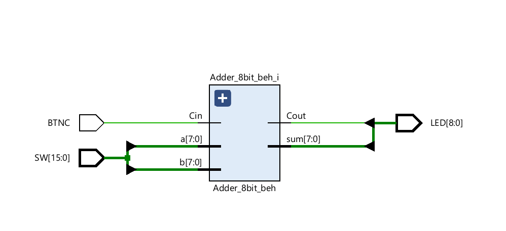
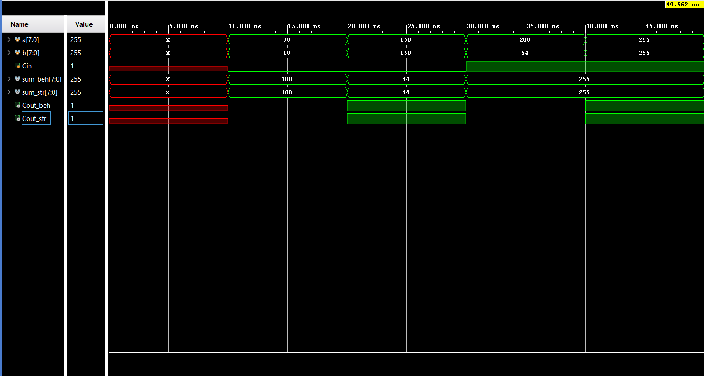

# Lab 2 – 8-Bit Adder: Behavioral vs. Structural

## Overview
Design, verification and FPGA implementation of two 8-bit adders with carry-in and carry-out, targeting the Digilent Nexys A7-100T board (Artix-7 `xc7a100t`) in Vivado.

- **Behavioral** (`Adder_8bit_beh.v`): a single continuous assignment using the Verilog `+` operator: `{Cout, sum} = a + b + Cin`.
- **Structural** (`Adder_8bit_str.v`): an 8-bit ripple-carry adder built from 8 chained instances of a 1-bit `Full_Adder`, where `S = z ^ (x ^ y)` and `C = z & (x ^ y) | (x & y)`.

## Interface
| Port | Direction | Width | Description |
|---|---|---|---|
| `a` | input | 8 | Unsigned operand A |
| `b` | input | 8 | Unsigned operand B |
| `Cin` | input | 1 | Carry-in |
| `sum` | output | 8 | Sum of a + b + Cin |
| `Cout` | output | 1 | Carry-out |

## Top Level (`Chip_Top`)
The behavioral adder is instantiated in `Chip_Top` and mapped to the board:
- `SW[7:0]` → `a`, `SW[15:8]` → `b`
- `BTNC` (center push-button) → `Cin`, allowing live control of the carry-in during the board demo
- `LED[7:0]` ← `sum`, `LED[8]` ← `Cout`

## Verification
`Adder_8bit_TB.v` drives both implementations with identical stimulus in parallel and prints inputs, outputs and simulation time for each adder using `$monitor`.

| Scenario | a | b | Cin | Sum | Cout |
|---|---|---|---|---|---|
| No carry-out | 90 | 10 | 0 | 100 | 0 |
| With carry-out | 150 | 150 | 0 | 44 | 1 |
| No carry-out, max value | 200 | 54 | 1 | 255 | 0 |
| Max overflow | 255 | 255 | 1 | 255 | 1 |

Both implementations produced identical results in all scenarios.

## Implementation Results
Lint reported no violations. Synthesis, implementation and bitstream generation completed with 0 errors and 0 critical warnings. The design was tested on the Nexys A7 board.

| Resource | Used | Available | Util % |
|---|---|---|---|
| Slice LUTs | 8 | 63400 | 0.01% |
| Slice Registers | 0 | 126800 | 0.00% |
| Bonded IOB | 26 | 210 | 12.38% |

- **Timing:** the design is purely combinational with no clock, so no timing constraints were defined and no paths fail.
- **Power:** the estimate is approximate, since Vivado cannot compute dynamic power without a defined clock.

Full reports: [`reports/`](reports/)

## Behavioral vs. Structural
The behavioral implementation is concise and readable: a single line of code, leaving the hardware mapping to the synthesis tool. The structural implementation requires manually building each full adder and explicitly chaining the carry, which gives full control over the architecture but makes the code longer and more error-prone.

Following the lab requirements, only the behavioral implementation was synthesized and deployed to the board (8 slice LUTs). The structural implementation was verified in simulation, where it matched the behavioral results in all scenarios.

## Repository Structure
- `src/` – design sources (`Adder_8bit_beh.v`, `Adder_8bit_str.v`, `Full_Adder.v`, `Chip_Top.v`)
- `tb/` – shared testbench (`Adder_8bit_TB.v`)
- `constraints/` – pin mapping for the Nexys A7 (`Chip_Top_Lab2.xdc`)
- `reports/` – Vivado utilization, timing and power reports
- `images/` – RTL schematic and simulation waveform
- `bitstream/` – validated bitstream for the Nexys A7 (`Chip_Top.bit`)
